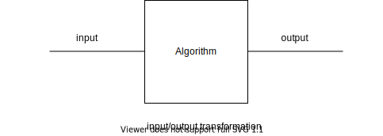
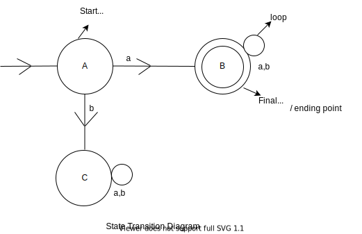
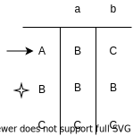

# My Notes for Theory of Computation

## Basic

Program Express an algorithm <br>
Theory of computation is same as like theory of algorithms or theory of programs.

An algorithm is a recipe for carrying out input to output transformation



Every algorithm computes a function

__Basic goal__ of theory of computation is to identify the class of function which admit algorithm to compute them

- for function `f` there is an algorithm for to comput `f(a)` <br>
- or do not admit any algorithm to compute them

__Basic Concepts of TOC__ <br>

- __symbols__ is a basic building of block for theory of computation. <br>
Example : `0-9`, `a-z`
- __alphabets__ is a finite set of symbols. It is denoted by `Σ` (sigma) <br>
Example : `Σ = {a, b}
- __strings__ is a finite sequence of symbols. It is denoted by `W` and empty string is denoted by `ε` (epsilon). <br>
Example : `aaa, 000`
- __languages__ is a collection of finite / infinte strings.

```c
Example : `{aaa, bbb, ccc, 000, 001}`

Power of Σ :
Σ = {a, b}
Σ^1 = set of all strings over the Σ of length 1
Ex : {a, b}
Σ^2 = set of all strings over the Σ of length 2
Ex : {aa, ab, bb, ba}

Σ = {0, 1}
Σ^* is the set of all finite binary strings over the Σ

A formal language `L` over the Σ is a subset of Σ^*
```

## Finate Automation

```shell
Ex : finite language

Σ = {a, b}
L = set of all strings over the Σ of length 2
  = {aa, bb, ab, ba}
```

If we want to check `aab` is it exist in the language or not, then it is use linear search and we will get wrong answer because length is 2 but our input length was 3

```shell
Ex : Infinite language

Σ = {a, b}
L = set of all strings over the Σ which start with 'a'
  = {aaa, abb, aab, bba....}
```

If we want to check `aaab` is it exist in the language or not, then it is use linear search. Since the language is infnite so we can't check it in the finite memory, it crush the computer...

So, convert infinite system to finite system called finite automation for checking infinite string over the finite memory.



```shell
W = aab
It takes this `A -> B -> B` steps for checking and we got answer easily

W = baa
It takes this `A -> C -> C` steps for checking and we got answer easily
```

__Classification of Finite Automation__ <br>

```c
`1) FA with output
    1) more machine
    2) milay machine
2) FA without output
    1) DFA
    2) NFA
    3) ε-NFA
```

DFA (deterministic finite automation) is a finite automation which contains 5 tuples (Q, Σ, δ, q0, F)
. For DFA in each input there would be a one state

From transition diagram :

- Q = set of all state
    - {A, B, C}
- Σ = set of all alphabets
    - {a, b}
- δ = transition function
    - formal notation δ = Q X Σ -> Q
    - traverse one state to another based on input called transition
- q0 = Start state
    - {A}
- F = set of all final states [It can be more than one]
    - {B}

__Diagram of Transition function__

